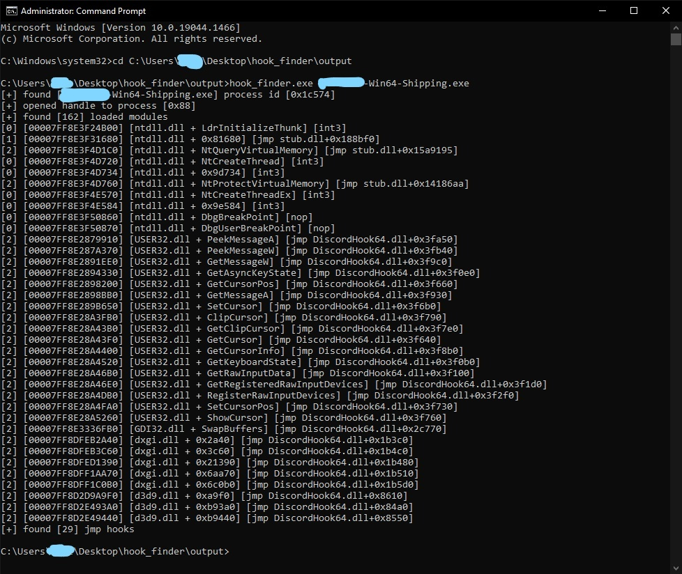

# hook-scanner
Scans all modules in target process for jmp/int3 hooks dissassembles then and follows jmps to destination.

## Procedure
1. The process enumerates every modules .text section and dissassembles each instruction using [zydis dissassembler](https://github.com/zyantific/zydis)
2. The instruction is compared against the module on disk to check for patch.
3. If it is a patched instruction checks if it is a jmp and proceeds to resolve the jmp destination
4. If the jmp destination leads to an absolute jmp it follows it and prints the result (module + offset)
5. It can be customized to decent int3 (breakpoint hooks) and other patches like nop
6. Before logging checks if the function is exported for better and easier logging/analysis
7. It can be customized to skip modules that you don't want to get scanned [here](https://github.com/armvirus/hook-scanner/blob/21010632c050f89aff219254087d20d8970085ff/hook_scanner/scanner.cpp#L119)
## Example Usage


Note: this project was coded in 1 day so it might have some bugs (open ticket)<br />

## Usage

```hook_scanner.exe process.exe```
